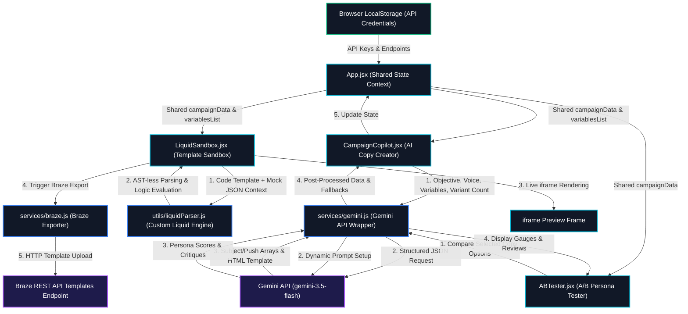

# SmartCanvas AI ⚡
> **An AI-powered Campaign Builder, Live Liquid Personalization Sandbox, and Agentic A/B Persona Response Simulator designed for lifecycle marketers and CRM developers.**

SmartCanvas AI is a premium single-page React web application that bridges the gap between marketing automation systems (like Braze, Salesforce Marketing Cloud) and Generative AI. It helps lifecycle campaign managers draft responsive HTML templates, test complex personalization syntax instantly on mock customer segments, and validate copy options using AI buyer persona simulation before launching.

---

## 🛠️ The Problem It Solves

As a Campaign Manager, executing lifecycle campaigns involves key pain points:
1. **HTML & Liquid Development**: Writing email templates with inline CSS and correct Liquid templating logic (``, `{{ user.first_name }}`) can be slow and error-prone.
2. **Personalization QA Fatigue**: Testing how dynamic emails render for different user attributes usually requires search queries against live user databases or setting up complex test profiles in production.
3. **Pre-deployment A/B Copy Testing**: A/B testing is usually reactive—you only see what works *after* you've emailed thousands of users and risked list fatigue.

**SmartCanvas AI** provides a unified tool to solve these issues locally, safely, and instantly.

---

## ✨ Core Features

### 1. Campaign AI Copilot
* **Objective-driven Generation**: Input a marketing goal (e.g. *"Re-engage inactive users with a free Blizzard coupon"*), select a brand tone (Playful, Bold/Urgent, Professional, Warm), and toggle user variables.
* **Multi-Channel Output**: Gemini generates optimized A/B subject lines, push notifications, and a fully responsive HTML email template.
* **Pre-coded Liquid Logic**: The output template automatically integrates dynamic Liquid conditions checking for attributes like membership tier or favorite flavors, with appropriate default fallbacks.
* **Direct Sandbox Integration**: Transfer your draft directly to the Live Sandbox in a single click.

### 2. Interactive Liquid Sandbox
* **Triple-Pane Workspace**: A synchronized editor view containing:
  * **Left (Code Editor)**: The HTML template containing Liquid markup.
  * **Middle (JSON Context & Profile Selector)**: Toggle pre-configured user profile segments (e.g., Alice - VIP Gold, Bob - Silver Tier, Charlie - New User) or edit raw JSON properties on the fly.
  * **Right (Visual Render)**: A live iframe showing the resolved HTML layout.
* **Client-side Logic Parser**: Uses a custom-built depth-counting logic parser to evaluate variables (`{{ }}`) and conditional rules (``, ``, ``) instantly in the browser without network latency.

### 3. A/B Persona Simulator (Agentic AI)
* **Audience Empathy Pre-testing**: Push copy concepts to an AI target audience panel before deployment.
* **Simulated Personas**: Queries Gemini to simulate three distinct consumer profiles built dynamically based on your product context (e.g. Sarah - Busy Parent, Marcus - Budget Student, Robert - Retiree).
* **Metrics & Feedback**: Personas score each variant (0-100) with visual progress bars and give detailed qualitative critiques explaining why they would open, ignore, or click.

### 4. Developer Settings Hub
* **API Key Security**: Input your Gemini API key (obtained from Google AI Studio). The key is stored purely inside your browser's local `localStorage` and never leaves your machine.
* **Zero-Setup Mock Mode**: If no API key is supplied, the application runs on a robust, context-aware simulation engine. Marks can instantly test features out of the box using preset Dairy Queen/Blizzard marketing campaigns.

---

## 📐 System Architecture & Data Flow



### Component Breakdown
*   **App.jsx**: Houses single-source-of-truth states (`campaignData` and `variablesList`) shared across views.
*   **CampaignCopilot.jsx**: UI to define custom Liquid tags (enforcing naming rules) and request up to 50 copy variants. Features tag toolbars to insert elements at the cursor.
*   **LiquidSandbox.jsx**: Syncs custom variables automatically into mock JSON profiles and triggers client-side AST-less Liquid compilation.
*   **ABTester.jsx**: Compares any combination of generated variants inside the audience simulation.
*   **services/gemini.js**: Interfaces client-side with Gemini API using JSON Schema outputs and exponential backoff retry logic. Handles mock generation for keyless operation.
*   **utils/liquidParser.js**: Client-side regex template compiler resolving variable filters (`| default: 'val'`) and conditional tags (``).

---

## 💻 Tech Stack

* **Core Framework**: React (Vite-powered Single Page Application)
* **Styling**: Vanilla CSS3 Custom Design System (HSL tokens, glassmorphism, responsive grid, visual scrollbars, dark mode theme)
* **Icons**: Lucide React
* **AI Integration**: Google Gemini API (`gemini-2.5-flash` model with JSON schema compliance)
* **Logic Parsing**: Custom client-side Regex/Depth-counting parser

---

## 🚀 Getting Started

### Prerequisites
* [Node.js](https://nodejs.org/) (v18+)
* [npm](https://www.npmjs.com/)

### Installation

1. Clone the repository:
   ```bash
   git clone https://github.com/mzubtsova/smart-canvas-ai.git
   cd smart-canvas-ai
   ```

2. Install dependencies:
   ```bash
   npm install
   ```

3. Run the development server:
   ```bash
   npm run dev
   ```

4. Open [http://localhost:5173](http://localhost:5173) in your browser to interact with the app!

---

## 🎨 UI Design Preview
The interface features a custom premium dark dashboard design utilizing:
* Glassmorphic panels with subtle glowing borders (`rgba(255,255,255,0.06)`).
* Harmonious color palettes using custom HSL tokens (Indigo primary accents, Purple secondary accents, and Emerald success states).
* Fully fluid layouts designed to scale beautifully on desktop, laptop, and tablet displays.
