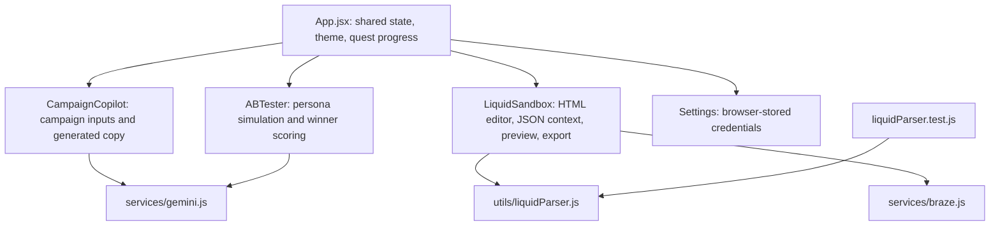

# SmartCanvas AI

> AI-assisted CRM campaign development, Liquid personalization QA, and persona-based copy testing for lifecycle marketers and Braze builders.

SmartCanvas AI is a Vite + React campaign workspace built around a realistic lifecycle marketing workflow: draft multi-channel campaign copy, generate responsive email HTML, test Liquid logic against mock customer data, compare variants with AI personas, and export the finished template for Braze or as a standalone HTML file.

## Why It Exists

Lifecycle campaign work often breaks down in the handoff between strategy, copy, personalization logic, QA, and platform execution. SmartCanvas AI keeps those steps in one focused interface so a campaign manager or CRM developer can move from idea to testable template faster.

It is designed for workflows like:

- Win-back campaigns with loyalty offers
- Personalized Braze email templates
- Liquid fallback testing before launch
- Subject line, push, SMS, IAM, and content card copy ideation
- Directional A/B feedback before spending audience attention
- Braze template handoff or HTML download

## Product Flow

1. **Campaign AI Copilot**
   Enter the campaign objective, tone, number of variants, and Liquid personalization tags. Gemini generates subject lines, push notifications, SMS, in-app messages, content cards, and responsive email HTML. Without an API key, the app runs in a polished demo mode.

2. **Interactive Liquid Sandbox**
   Edit the email HTML, add/remove/insert Liquid tags, switch between mock customer profiles, edit raw JSON, and preview the personalized result live. The sandbox includes parser warnings, variable counts, preview status, and HTML download.

3. **A/B Persona Simulator**
   Compare copy variants against simulated audience personas. The report shows per-persona scores, qualitative critiques, and a predicted winner based on average directional response.

4. **Settings Hub**
   Save optional Gemini and Braze credentials in browser local storage for demo/private use. The app continues to work without credentials through simulated mode.

5. **Launch Quest**
   A four-step checklist that guides the demo workflow: brief, generate copy, QA the personalization, then export or download.

## Current Feature Set

- Gemini campaign generation using `gemini-2.5-flash`
- Mock generation mode for no-key demos
- Subject line, push, SMS, in-app message, and content card variant generation
- Responsive HTML email generation
- Custom Liquid tag creation, quick insertion, and removal
- Client-side Liquid-like parser with nested conditionals
- Supported filters: `default`, `uppercase`/`upcase`, `lowercase`/`downcase`, `capitalize`
- Parser QA insights for variables, unsupported tags, and missing `` blocks
- Mock profile switching and editable JSON context
- Live iframe preview of resolved email HTML
- HTML template download
- Braze email template export or simulated export
- AI persona A/B review with average winner chip
- Light/dark theme toggle
- Responsive desktop, tablet, and mobile layouts
- Gamified Launch Quest progress indicator with step-by-step hover guidance
- Hover help for key controls on desktop

## Tech Stack

- **Frontend:** React 18, Vite
- **Styling:** Custom CSS design system with light/dark tokens
- **Icons:** Lucide React
- **AI:** Google Gemini API
- **Marketing Platform:** Braze Templates API integration path
- **Testing:** Vitest parser unit tests
- **Quality:** ESLint flat config, production build verification

## Architecture


```mermaid
graph TD
  App["App.jsx: shared state, theme, quest progress"]
  Copilot["CampaignCopilot: campaign inputs and generated copy"]
  Sandbox["LiquidSandbox: HTML editor, JSON context, preview, export"]
  Tester["ABTester: persona simulation and winner scoring"]
  Settings["Settings: browser-stored credentials"]
  Gemini["services/gemini.js"]
  Braze["services/braze.js"]
  Parser["utils/liquidParser.js"]
  Tests["liquidParser.test.js"]

  App --> Copilot
  App --> Sandbox
  App --> Tester
  App --> Settings
  Copilot --> Gemini
  Tester --> Gemini
  Sandbox --> Parser
  Sandbox --> Braze
  Tests --> Parser
```

## Security Notes

This is a portfolio/demo application. Gemini and Braze keys are stored in browser `localStorage` only when the user enters them. That keeps the app easy to demo, but a production SaaS version should move provider calls behind a serverless API layer with encrypted secrets, workspace-level auth, request auditing, and rate limiting.

## Getting Started

```bash
git clone https://github.com/mzubtsova/smart-canvas-ai.git
cd smart-canvas-ai
npm install
npm run dev
```

Open `http://localhost:5173`.

## Quality Checks

```bash
npm run lint
npm run test
npm run build
```

## Roadmap

- Add serverless proxy endpoints for Gemini and Braze credentials
- Add spam/readability scoring for subject lines and email body
- Add CSV upload for custom mock user profiles
- Add saved campaign history
- Add email-client viewport presets
- Add Liquid branch coverage reporting
- Add accessibility and deliverability QA checks
